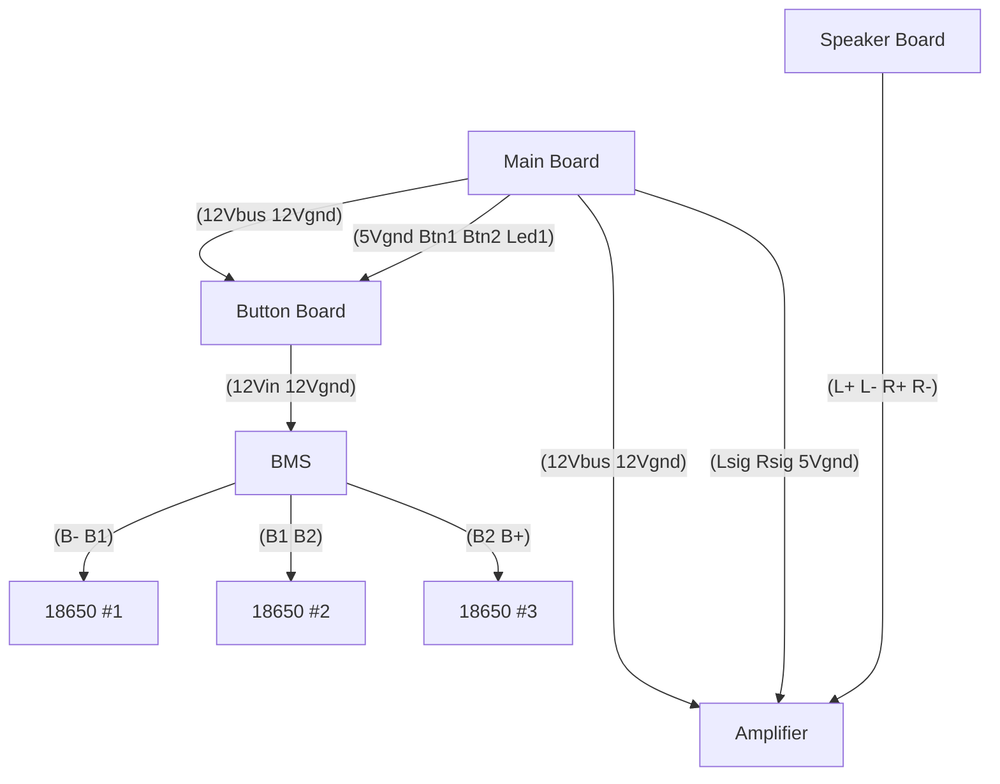

# Components & I/O
- Main Board
    - XH x2 (from button board)
        - 12Vbus
        - 12Vgnd
    - XH x4 (button board)
        - 5Vgnd
        - Btn1
        - Btn2
        - Led
    - XH x2 (to Amp)
        - 12Vbus
        - 12Vgnd
    - XH x3 (amp)
        - Lsig
        - Rsig
        - 5Vgnd
- Button Board
    - XH x2 (to main board)
        - 12Vbus
        - 12Vgnd
    - XH x2 (to BMS)
        - 12Vin
        - 12Vgnd
    - XH x4 (to main board)
        - Btn1
        - Btn2
        - Led
        - 5Vgnd
- BMS Board
    - XH x2 (from button board)
        - 12Vin
        - 12Vgnd
    - XH x2 (goes to battery)
        - B-
        - B1
    - XH x2 (goes to battery)
        - B1
        - B2
    - XH x2 (goes to battery)
        - B2
        - B+
- Speaker Board
    - XH x4 (from amp)
        - L+
        - L-
        - R+
        - R-
- Amp
    - XH x2 (from main board)
        - 12Vbus
        - 12Vgnd
    - XH x3 (from main board)
        - Lsig
        - Rsig
        - 5Vgnd
    - XH x4 (to speaker board)
        - L+
        - L-
        - R+
        - R-

# Main Board Concept
1 stripboard containing:
- tilt reset
- tilt trigger
- rp2040
- buck
- JST/XH headers

# Mermaid

